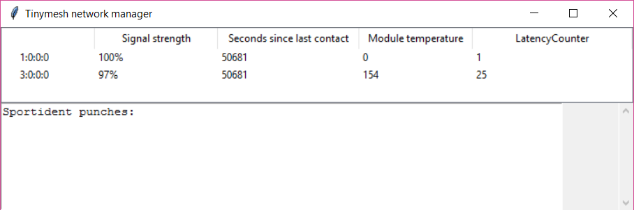

# A central gateway application for a SportidentTinymesh network
Management application for a Tinymesh radio network.
Listens to a serial COM port on the local PC where you have connected a Tinymesh module working as gateway of the Tinymesh network. By default, a Tinymesh network forwards all data packets sent from any node to the gateway. The application parses incoming packets and shows both network management health status and received Sportident punches in a GUI:



## Environment and prerequisites before running
This is a python 3 application. It is tested on a Windows PC, but should be able to run on any python platform with a serial port and a GUI.
The app uses the tkinter framework do drive the GUI. If your platform has a GUI, your python 3 installation should already have tkinter included.
Install other needed packages:
```
>pip install construct
>pip install dirq
>pip install pyserial
````

Verify that everything is set up correctly by running the unit test suite included:
```
>python test.py
```
## The Tinymesh gateway module
This application is intended to run with a Tinymesh module connected to a serial port of the PC. If you don't have one, you can simulate it with test_tm_live_data.py, see below.
For convenience, we have used the Tinymesh Development Kit ([manual](https://radiocrafts.com/uploads/rcxxxxdk-usb_user_manual_1_12.pdf) and [quickstart guide](https://radiocrafts.com/uploads/rcxxxxdk-usb_quick_start_1_1.pdf)) which you connect via USB.
The Tinymesh module should be configured as gateway with packet mode enabled. Use the [CCT (Configuration and Communication Tool)](https://radiocrafts.com/resources/software-tools/) from Radiocrafts to configure the gateway. 

## Usage 
Start the comwrapper part that grabs incoming Tinymesh packets from the gateway:
```
C:\Temp> python comwrapper.py port=COM1 baudrate=9600
```

In a separate process, start the GUI part of the application:
```
C:\Temp> python gui.py
```
    
## Sourcedoce and files documentation
Below is an overview of what is in each of the files in this repository. The python code is documented using docstrings.

### comwrapper.py
A python script that should _allways_ be running when the Tinymesh network is active. It listens to incoming packets on the serial port (where your Tinymesh Gateway should be connected) and writes the packets to a store-and-forward queue on disk, which is later read by the TinymeshController. The reason for running this in a separate process is to ensure no packets from the Tinymesh gateway are lost due to timing issues in the gui part. The Tinymesh gateway does not wait for acknowledgement of packets it sends to the PC, so we really need to make sure every packet is grabbed and stored in real time. 

### gui.py
A python script that runs the GUI part of the application. Invokes TinymeshController regularly and displays the health of radios, and shows any received Sportident punches.

### tmcontroller.py
Defines the class TinymeshController which checks for new Tinymesh packets on the store-and-forward queue, parses them, and updates a record of health and connectivity status for each radio unit. If a received packet contains a Sportident punch, parse it and log the punch. TinymeshController is a singleton that we call often from the event loop in the GUI.

### myqueuemanager.py
Defines the queues used for secure store-and-forward communication between the comwrapper and the TinymeshController in the gui process. It creates a directory C:\Temp\tmsi for the messages. It sets up queues for both directions, but currently we only handle incoming packets, i.e. from comwrapper to gui.

### siparser.py
Defines parsing of a Sportident station punch.

### tmparser.py
Defines parsing of all different kinds of Tinymesh radio packets.

### test_tm_live_data.py and live_test_data.txt
If you don't have a Tinymesh devkit module, you can simulate it. 
Use a virtual COM port program like Eltima Virtual Serial Port Driver and create a virtual com port pair between COM1 and COM2 (this will feed any output to COM2 right back to COM1, where comwrapper should be listening.
Then simply run 
```>python test_tm_live_data.py``` 
which will feed actual captured live data from the file live_test_data.txt to the serial port COM2 in binary format. 

## TODO
* Send punches to competition administration system using SIRAP.
* Log sequence number of punches from each attached Sportident station (remember there can be more than one Sportident station per Tinymesh radio unit) and raise alarm when any gap in the sequence is detected. Show number of missing punches, control number, and time interval.
