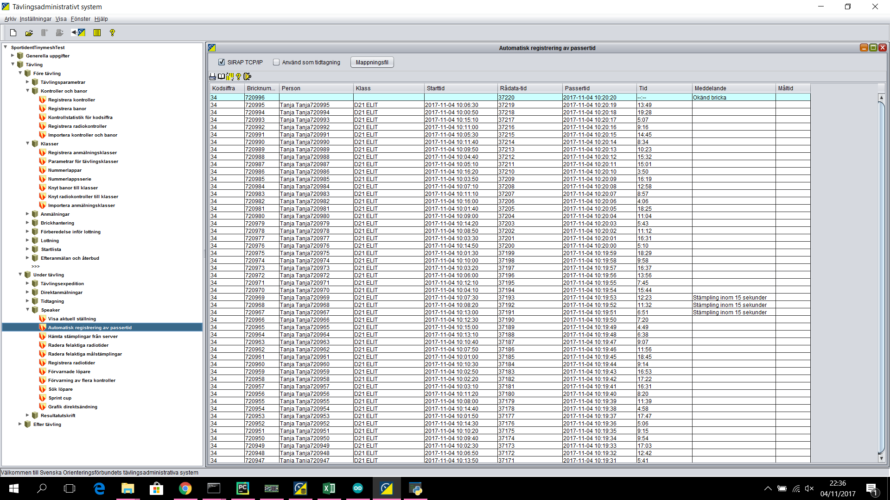

# Test 100 runners from recorded COM port input to OLA

This test was done by setting up a competition with a radio control and 100 runners in OLA. Then punches were generated with a Radio Unit running a Teensy program to generate synthetic punches.
The store-and-forward queue output from comwrapper was saved so you can "replay" the test from there.

Test steps to execute:
1. Install OLA 5.4.1 and restore the backup Tanja_OLA_backup.zip (details below).
2. Open an OLA windows for "Automatisk registrering av passertid" and check the SIRAP TCP checkbox.
3. Start the GatewayApplication gui part: > python gui.py
4. Unpack the Tanja_port_in_Radio1.zip file and take all contents of the port_in_test directory and copy it to C:\temp\tmsi\port_in\
5. Now all 100 radio punches should flow into OLA all at once. 
6. Compare your output with the screenshot Tanja_OLA_radio.png (see below).
7. Now unpack Tanja_port_in.zip in a similar way as step 4 above. See 100 punches at Radio 2 flow in.

## OLA db restore details
Database DSN:
C:\ProgramData\OLA5\db\SportidentTinymeshTest;MVCC=TRUE;AUTO_SERVER=TRUE;IGNORECASE=TRUE

Datamase Name:
SPORTIDENTTINYMESHTEST
